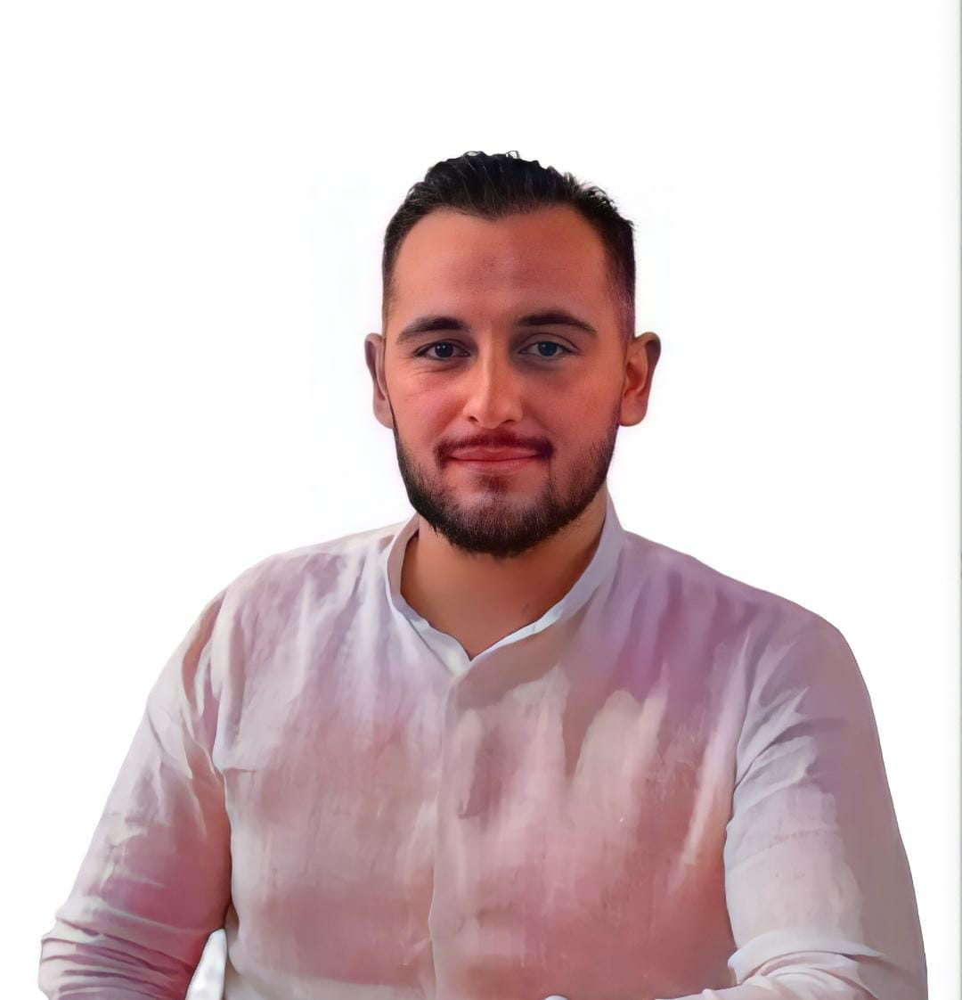

<html lang="en">

<head>

    <meta name="google-site-verification" content="0hJ8jug-XxHPrRFzH_mslLafvPpysxxd8O42VJ3PwuM">

    <meta charset="UTF-8">

    <meta name="viewport" content="width=device-width, initial-scale=1.0">

    <title>Ardit Koka | Economics</title>

    <meta
        name="description"
        content="Academic website of Ardit Koka, PhD Candidate at the University of Insubria. Research in macroeconomics, monetary economics, banking, financial intermediation and central bank digital currencies."
    >

    

</head>

<body>

    <header>

        

            

                

                

                    <h1>Ardit Koka</h1>

                    

                        PhD Candidate in Economics
                    

                    

                        Methods and Models for Economic Decisions · University of Insubria
                    

                

            

        

    </header>

    <main class="container">

        <nav
            class="tabs"
            role="tablist"
            aria-label="Academic website sections"
        >

            <button
                class="tab active"
                type="button"
                role="tab"
                aria-selected="true"
                data-tab="home"
            >
                Home
            </button>

            <button
                class="tab"
                type="button"
                role="tab"
                aria-selected="false"
                data-tab="research"
            >
                Research
            </button>

            <button
                class="tab"
                type="button"
                role="tab"
                aria-selected="false"
                data-tab="teaching"
            >
                Teaching
            </button>

            <button
                class="tab"
                type="button"
                role="tab"
                aria-selected="false"
                data-tab="cv"
            >
                CV
            </button>

        </nav>

        <section
            id="home"
            class="tab-content active"
            role="tabpanel"
        >

            <h2>About</h2>

            

                I am a PhD Candidate in
                <a
                    href="https://www.phd.eco.uninsubria.it/methods-and-models-for-economic-decisions/phd-students/"
                    target="_blank"
                    rel="noopener noreferrer"
                >
                    Methods and Models for Economic Decisions
                </a>
                at the University of Insubria.
            

            

                My research lies at the intersection of macroeconomics,
                monetary economics, banking, and digital finance.
                I am particularly interested in central bank digital currencies,
                bank funding and financial intermediation, prudential liquidity
                regulation, financial stability, and monetary-policy transmission.
            

            

                From September 2025 to May 2026, I was a Visiting PhD Researcher
                at Lancaster University Management School.
            

            <h2>Contact</h2>

            

                Department of Economics 
                University of Insubria 
                Varese, Italy
            

            

                <a href="mailto:akoka@uninsubria.it">
                    akoka@uninsubria.it
                </a>

                <a
                    href="https://it.linkedin.com/in/ardit-koka-7758941aa"
                    target="_blank"
                    rel="noopener noreferrer"
                >
                    LinkedIn
                </a>

            

        </section>

        <section
            id="research"
            class="tab-content"
            role="tabpanel"
        >

            <h2>Research Interests</h2>

            

                Macroeconomics · Monetary Economics · Money and Banking ·
                Financial Intermediation · Central Bank Digital Currencies ·
                Monetary Policy Transmission · Financial Stability · DSGE Models
            

            <h2>Working Papers</h2>

            

                

                    When Funding Neutrality Fails: CBDC, Refinancing, and Prudential Liquidity
                

                

                    Working paper · Manuscript available soon
                

                

                    Abstract
                

                

                    This paper studies whether central-bank refinancing can neutralise
                    the bank-credit effects of deposit displacement caused by a capped,
                    non-remunerated retail CBDC. I develop a nonlinear New Keynesian
                    model with cash, bank deposits, CBDC, central-bank refinancing,
                    marketable liquid assets, and an occasionally binding
                    prudential-liquidity requirement. One-for-one refinancing restores
                    the quantity of bank funding exactly, but it does not generally
                    preserve bank credit because deposits and central-bank borrowing
                    have different implications for prudential liquidity. The
                    credit-minimising refinancing ratio can therefore lie above, at,
                    or below one-for-one depending on the net liquidity transformation
                    generated by refinancing and the persistence of liquidity stress.
                    Quantitatively, one-for-one refinancing is nearly credit-neutral
                    under short-lived stress when refinancing generates sufficient
                    prudential liquidity, but remains materially non-neutral when
                    liquidity stress persists. Moreover, the refinancing ratio that
                    best stabilises credit need not maximise welfare. Replacing the
                    quantity of deposits displaced by CBDC is therefore not sufficient
                    to guarantee equivalence in bank intermediation.
                

            

            <h2>Presentations & Seminars</h2>

            

                

                    CBDC and Monetary Policy Transmission:
                    A Two-Tier Design with Bank Intermediation Frictions
                

                

                    SoFiE Summer School and Conference on Structural Macro Modelling
                

                

                    National Bank of Belgium · Brussels · May 2026
                

            

            

                

                    CBDC and Monetary Policy Transmission:
                    A Two-Tier Design with Bank Intermediation Frictions
                

                

                    Departmental Research Presentation · Department of Economics
                

                

                    Lancaster University · 18 May 2026
                

            

            

                

                    CBDC and Monetary Policy Transmission:
                    A Two-Tier Design with Bank Intermediation Frictions
                

                

                    Workshop on Applied Economic Methods ·
                    PhD Programme in Methods and Models for Economic Decisions
                

                

                    Department of Economics, University of Insubria · 13 May 2026
                

            

            <h2>Invited & Guest Lectures</h2>

            

                

                    From Cryptocurrencies to Central Bank Digital Currencies
                

                

                    Postgraduate Course in Monetary and Credit Economics
                

                

                    University of Insubria · 30 April 2024
                

            

        </section>

        <section
            id="teaching"
            class="tab-content"
            role="tabpanel"
        >

            <h2>Teaching</h2>

            

                

                    Statistics
                

                

                    Università degli Studi di Milano
                

                

                    I teach undergraduate Statistics, covering probability,
                    estimation, statistical inference, hypothesis testing,
                    and regression. Teaching combines theoretical concepts with
                    guided exercises, quantitative problem solving, and preparation
                    of assessment materials.
                

            

            

                

                    Economics & Quantitative Methods
                

                

                    University of Insubria
                

                

                    As an Honorary Fellow and Academic Tutor, I contribute to
                    teaching, examination activities, and student support in
                    Macroeconomics, Monetary and Credit Economics, Statistics,
                    Applied Statistics, Mathematics, and quantitative methods.
                

            

            <h2>Teaching Approach</h2>

            

                My teaching emphasises economic and statistical intuition alongside
                structured problem solving. I aim to help students understand not
                only how to apply a method, but why it is appropriate and how to
                interpret the result.
            

        </section>

        <section
            id="cv"
            class="tab-content"
            role="tabpanel"
        >

            

                <h2>Curriculum Vitae</h2>

                

                    My academic curriculum vitae will be available here shortly.
                

                

                    Academic CV coming soon
                

            

        </section>

    </main>

    <footer class="container">

        &copy;  Ardit Koka

    </footer>

    

</body>

</html>
